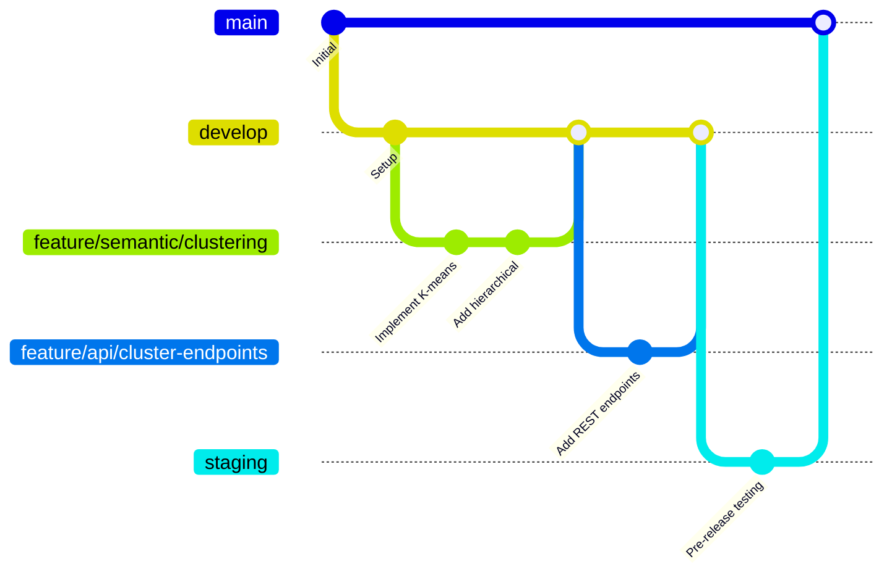

# Git Workflow Documentation - LLM.txt Mastery Semantic Enhancement

## Branching Strategy Overview

This document defines the Git workflow, branching model, and collaboration practices for the 7-week semantic enhancement project. The strategy is designed for parallel development with clear integration points and minimal merge conflicts.

## Branch Naming Convention

### Pattern Structure

```
<type>/<module>/<brief-description>
```

### Type Prefixes

- **feature/**: New functionality implementation
- **enhancement/**: Improvements to existing functionality
- **fix/**: Bug fixes and corrections
- **infrastructure/**: Database, deployment, and infrastructure changes
- **documentation/**: Documentation updates
- **refactor/**: Code restructuring without functional changes

### Module Prefixes

- **database**: Database schema, migrations, pgvector setup
- **semantic**: Clustering, tagging, embeddings services
- **api**: REST endpoints, validation, integration
- **frontend**: React components, UI, user experience
- **testing**: Test implementations, QA automation
- **ops**: Deployment, monitoring, infrastructure

### Example Branch Names

```bash
feature/semantic/clustering-algorithm
enhancement/api/response-caching
fix/database/pgvector-index-performance
infrastructure/ops/feature-flag-setup
documentation/api/endpoint-specifications
refactor/frontend/component-structure
```

## Core Branch Structure

### Main Branches

#### `main`

- **Purpose**: Production-ready code
- **Protection**: Protected branch, no direct pushes
- **Merging**: Only from `develop` via pull request
- **Deployment**: Automatically deploys to production
- **Stability**: Must always be deployable

#### `develop`

- **Purpose**: Integration branch for ongoing development
- **Protection**: Protected branch, no direct pushes
- **Merging**: From feature branches via pull request
- **Testing**: All automated tests must pass
- **Deployment**: Automatically deploys to staging

#### `staging`

- **Purpose**: Release preparation and final testing
- **Source**: Created from `develop` when release ready
- **Testing**: Comprehensive QA testing environment
- **Lifecycle**: Merged to `main` after approval, then deleted

### Feature Development Flow



## Phase-Based Development Strategy

### Phase 1 (Weeks 1-2): Foundation

**Parallel Development Tracks**:

- `feature/database/pgvector-setup`
- `feature/database/schema-extensions`
- `feature/semantic/openai-integration`
- `feature/semantic/embedding-cache`

**Integration Strategy**: Daily merges to `develop`, continuous staging deployment

### Phase 2 (Weeks 3-4): Core Features

**Parallel Development Tracks**:

- `feature/semantic/clustering-engine`
- `feature/semantic/tagging-service`
- `feature/api/enhancement-endpoints`
- `feature/semantic/sequencing-modes`

**Integration Strategy**: Feature branches merge to `develop` every 2-3 days

### Phase 3 (Weeks 5-6): UI Integration

**Parallel Development Tracks**:

- `feature/frontend/cluster-visualization`
- `feature/frontend/sequencing-controls`
- `feature/frontend/preview-system`
- `enhancement/api/frontend-integration`

**Integration Strategy**: Daily integration testing on `develop`

### Phase 4 (Week 7): Production Preparation

**Focused Development**:

- `fix/*`: Bug fixes and optimization
- `enhancement/*`: Performance improvements
- `infrastructure/ops/deployment-prep`

**Integration Strategy**: Multiple staging releases, careful production deployment

## Pull Request Process

### PR Template

```markdown
## Summary

Brief description of changes and motivation

## Type of Change

- [ ] New feature implementation
- [ ] Enhancement to existing feature
- [ ] Bug fix
- [ ] Infrastructure change
- [ ] Documentation update

## Module Impact

- [ ] Database schema changes
- [ ] Semantic analysis services
- [ ] API endpoints
- [ ] Frontend components
- [ ] Testing infrastructure
- [ ] Operations/deployment

## Testing Completed

- [ ] Unit tests added/updated
- [ ] Integration tests passing
- [ ] Manual testing completed
- [ ] Performance requirements met
- [ ] Accessibility requirements met (if UI)

## Performance Impact

- [ ] No performance impact
- [ ] Performance improvement
- [ ] Performance impact assessed and acceptable
- [ ] Performance regression requires discussion

## Database Changes

- [ ] No database changes
- [ ] Migration script included
- [ ] Migration tested in development
- [ ] Migration approved by database module owner

## Breaking Changes

- [ ] No breaking changes
- [ ] Breaking changes documented below
- [ ] Breaking changes coordinated with affected teams

## Security Considerations

- [ ] No security impact
- [ ] Security review completed
- [ ] Credentials/secrets handled properly
- [ ] Input validation implemented

## Documentation Updates

- [ ] Code comments updated
- [ ] API documentation updated
- [ ] README files updated
- [ ] Technical specification updated

## Deployment Notes

- [ ] No special deployment requirements
- [ ] Feature flag configuration required
- [ ] Infrastructure changes required
- [ ] Rollback plan documented

## Checklist

- [ ] Code follows team conventions
- [ ] Self-review completed
- [ ] Automated tests passing
- [ ] Manual testing completed
- [ ] Documentation updated
- [ ] Ready for review

## Additional Notes

[Any additional context, screenshots, or considerations]
```

### PR Review Requirements

#### Automatic Checks

- [ ] All CI/CD pipeline checks pass
- [ ] Code coverage meets minimum threshold (80%)
- [ ] No critical security vulnerabilities
- [ ] No performance regressions detected
- [ ] TypeScript compilation successful

#### Manual Review Requirements

- **Standard Features**: 1 approval from module owner
- **Cross-Module Changes**: 1 approval from each affected module owner
- **Architecture Changes**: 1 approval from Tech Lead
- **Database Changes**: 1 approval from database module owner
- **API Changes**: 1 approval from both backend and frontend owners

#### Review Timeline

- **Small Changes** (<100 lines): 4 hours
- **Medium Changes** (100-500 lines): 24 hours
- **Large Changes** (>500 lines): 48 hours
- **Architecture Changes**: 72 hours

## Commit Message Standards

### Conventional Commit Format

```
<type>(<module>): <description>

<optional body>

<optional footer>
```

### Commit Types

- **feat**: New feature implementation
- **enhance**: Enhancement to existing feature
- **fix**: Bug fix
- **docs**: Documentation changes
- **style**: Code style changes (formatting, etc.)
- **refactor**: Code refactoring
- **test**: Adding or updating tests
- **infra**: Infrastructure and deployment changes

### Examples

```bash
feat(semantic): implement k-means clustering algorithm

Add k-means clustering with configurable cluster count
and coherence score calculation. Includes caching for
performance optimization.

Closes #123

fix(api): handle invalid analysis ID in cluster endpoint

Add proper validation and error handling for non-existent
analysis IDs in the clustering API endpoint.

enhance(frontend): improve cluster visualization performance

Optimize rendering for large cluster datasets using
virtualization and memoization techniques.

infra(database): add pgvector performance indexes

Create IVFFlat indexes for vector similarity search
to improve query performance for large datasets.
```

### Commit Best Practices

- **Atomic Commits**: Each commit represents one logical change
- **Descriptive Messages**: Clear description of what and why
- **Present Tense**: Use present tense ("add feature" not "added feature")
- **Issue References**: Include issue numbers when applicable
- **Body Text**: Explain complex changes in the commit body

## Merge Strategies

### Feature Branch Merging

**Strategy**: Squash and Merge

- **Rationale**: Clean history, easier to revert features
- **Process**: Multiple commits in feature branch become single commit in develop
- **Commit Message**: Summarizes entire feature implementation

### Release Merging

**Strategy**: Merge Commit

- **Rationale**: Preserve release point history
- **Process**: Create explicit merge commit for releases
- **Commit Message**: Release version and summary

### Hotfix Merging

**Strategy**: Fast-Forward Merge

- **Rationale**: Immediate deployment, minimal history disruption
- **Process**: Critical fixes merged directly to main and develop

## Release Management

### Release Process

#### 1. Release Preparation

```bash
# Create staging branch from develop
git checkout develop
git pull origin develop
git checkout -b staging/v1.1.0
git push origin staging/v1.1.0
```

#### 2. Release Testing

- Deploy to staging environment
- Execute comprehensive test suite
- Perform user acceptance testing
- Complete performance validation

#### 3. Release Deployment

```bash
# Merge to main after approval
git checkout main
git pull origin main
git merge --no-ff staging/v1.1.0
git tag -a v1.1.0 -m "Release version 1.1.0: Semantic enhancements"
git push origin main
git push origin v1.1.0

# Clean up staging branch
git branch -d staging/v1.1.0
git push origin --delete staging/v1.1.0
```

### Version Numbering

**Semantic Versioning**: MAJOR.MINOR.PATCH

- **MAJOR**: Breaking changes or major feature sets
- **MINOR**: New features, backward compatible
- **PATCH**: Bug fixes, backward compatible

**Release Schedule**:

- **Weekly Minor Releases**: New features from completed phases
- **Daily Patch Releases**: Bug fixes and small enhancements
- **Major Release**: Final semantic enhancement delivery

## Hotfix Process

### Critical Issue Response

```bash
# Create hotfix branch from main
git checkout main
git pull origin main
git checkout -b fix/critical/issue-description
```

### Hotfix Development

1. **Implement Fix**: Minimal change to resolve issue
2. **Test Thoroughly**: Comprehensive testing of fix
3. **Create PR**: Fast-track review process
4. **Deploy Immediately**: Merge to main and deploy

### Hotfix Integration

```bash
# Merge to main
git checkout main
git merge fix/critical/issue-description
git push origin main

# Merge back to develop
git checkout develop
git merge main
git push origin develop

# Clean up hotfix branch
git branch -d fix/critical/issue-description
```

## Conflict Resolution

### Preventing Conflicts

- **Frequent Merges**: Merge develop into feature branches daily
- **Small Commits**: Keep changes atomic and focused
- **Communication**: Coordinate changes with team members
- **Module Boundaries**: Respect module ownership boundaries

### Resolving Conflicts

1. **Identify Conflicts**: Use git status and diff tools
2. **Communicate**: Coordinate with conflicting change authors
3. **Resolve Carefully**: Preserve all functional changes
4. **Test Thoroughly**: Verify resolution doesn't break functionality
5. **Document**: Explain resolution in commit message

### Conflict Resolution Tools

- **VS Code**: Built-in merge conflict resolution
- **GitKraken**: Visual merge conflict resolution
- **Command Line**: Traditional git merge tools

## Git Hooks and Automation

### Pre-Commit Hooks

```bash
#!/bin/sh
# .husky/pre-commit

# Run linting
npm run lint

# Run type checking
npm run type-check

# Run unit tests
npm run test:unit

# Run formatting check
npm run format:check
```

### Pre-Push Hooks

```bash
#!/bin/sh
# .husky/pre-push

# Run integration tests
npm run test:integration

# Run performance tests
npm run test:performance

# Check for sensitive data
npm run security:check
```

### Automated Workflows

- **CI/CD Pipeline**: Automated testing on every push
- **Dependency Updates**: Automated dependency updates
- **Security Scanning**: Automated security vulnerability scanning
- **Code Quality**: Automated code quality analysis

## Backup and Recovery

### Repository Backup

- **GitHub**: Primary repository hosting
- **Mirror**: Secondary mirror for redundancy
- **Local Backup**: Key contributors maintain local backups

### Branch Recovery

```bash
# Recover deleted branch
git reflog
git checkout -b recovered-branch <commit-hash>

# Recover deleted commits
git fsck --lost-found
git show <commit-hash>
```

### History Preservation

- **Protected Branches**: Main and develop branches protected
- **Tag Preservation**: Release tags preserved permanently
- **Audit Trail**: Complete history maintained

## Team Collaboration Guidelines

### Daily Workflow

1. **Start of Day**: Pull latest develop branch
2. **Feature Work**: Work in focused feature branches
3. **Regular Commits**: Commit logical changes frequently
4. **Daily Integration**: Merge develop into feature branch
5. **End of Day**: Push feature branch to origin

### Communication Protocol

- **Branch Creation**: Announce new feature branches in Slack
- **Large Changes**: Coordinate with affected team members
- **Merge Conflicts**: Resolve quickly and communicate resolution
- **Release Planning**: Coordinate release timing with team

### Best Practices

- **Clean History**: Use meaningful commit messages
- **Frequent Communication**: Over-communicate rather than under-communicate
- **Code Reviews**: Thorough and constructive reviews
- **Testing**: Comprehensive testing before merge requests

---

This Git workflow ensures smooth collaboration, maintains code quality, and supports rapid feature delivery throughout the 7-week semantic enhancement project.
