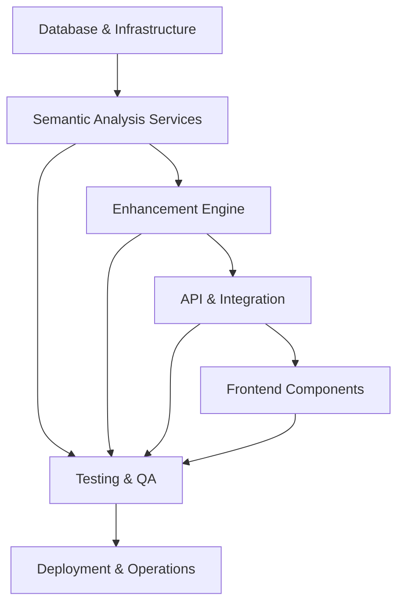

# Module Ownership Matrix - LLM.txt Mastery Semantic Enhancement

## Executive Summary

This document defines clear module ownership, responsibility boundaries, and decision-making authority for the 7-week semantic enhancement project. Each module has a designated owner, contributors, and escalation path.

## RACI Legend

- **R** (Responsible): Performs the work
- **A** (Accountable): Ultimate decision authority and accountability
- **C** (Consulted): Input required before decisions
- **I** (Informed): Kept informed of progress and decisions

## Module Breakdown & Ownership

### 1. Database & Infrastructure Module

**Module Scope**: pgvector setup, schema extensions, Redis caching, performance optimization

| Role                         | Backend Engineer | DevOps Engineer | Tech Lead | QA Engineer |
| ---------------------------- | ---------------- | --------------- | --------- | ----------- |
| **Database Schema Design**   | A,R              | C               | C         | I           |
| **pgvector Implementation**  | A,R              | R               | C         | I           |
| **Redis Cache Architecture** | A,R              | R               | C         | I           |
| **Performance Optimization** | R                | R               | A         | C           |
| **Migration Scripts**        | A,R              | C               | C         | I           |

**Owner**: Senior Backend Engineer  
**Deputy**: DevOps Engineer  
**Escalation**: Tech Lead

**Key Deliverables**:

- Database migration scripts
- pgvector indexes and optimization
- Redis caching layer
- Performance benchmarks

---

### 2. Semantic Analysis Services Module

**Module Scope**: OpenAI integration, clustering algorithms, tagging service, embedding management

| Role                         | Backend Engineer | AI/ML Specialist | Tech Lead | Frontend Engineer |
| ---------------------------- | ---------------- | ---------------- | --------- | ----------------- |
| **OpenAI API Integration**   | A,R              | C                | C         | I                 |
| **Clustering Algorithms**    | R                | A,R              | C         | I                 |
| **Semantic Tagging**         | A,R              | C                | C         | I                 |
| **Embedding Cache Strategy** | A,R              | I                | C         | I                 |
| **Service Architecture**     | A,R              | C                | C         | I                 |

**Owner**: Senior Backend Engineer  
**Deputy**: AI/ML Specialist (if available)  
**Escalation**: Tech Lead

**Key Deliverables**:

- Clustering service (K-means & hierarchical)
- Semantic tagging engine
- OpenAI embeddings service
- Caching and batch processing

---

### 3. Enhancement Engine Module

**Module Scope**: Description uniqueness, sequencing modes, summary generation, quality validation

| Role                     | Backend Engineer | Product Manager | Frontend Engineer | QA Engineer |
| ------------------------ | ---------------- | --------------- | ----------------- | ----------- |
| **Uniqueness Algorithm** | A,R              | C               | I                 | C           |
| **Sequencing Modes**     | A,R              | C               | I                 | C           |
| **Summary Generation**   | A,R              | C               | I                 | C           |
| **Quality Validation**   | A,R              | I               | I                 | A,R         |
| **Business Logic**       | R                | A               | I                 | C           |

**Owner**: Senior Backend Engineer  
**Deputy**: Product Manager  
**Escalation**: Tech Lead

**Key Deliverables**:

- Description uniqueness service
- Multi-mode sequencing engine
- Blockquote summary generator
- Quality validation system

---

### 4. API & Integration Module

**Module Scope**: REST endpoints, API documentation, request validation, response formatting

| Role                    | Backend Engineer | Frontend Engineer | QA Engineer | Tech Lead |
| ----------------------- | ---------------- | ----------------- | ----------- | --------- |
| **API Endpoint Design** | A,R              | C                 | I           | C         |
| **Request Validation**  | A,R              | C                 | C           | I         |
| **Response Formatting** | A,R              | C                 | I           | I         |
| **API Documentation**   | R                | C                 | I           | A         |
| **Integration Testing** | R                | R                 | A           | C         |

**Owner**: Senior Backend Engineer  
**Deputy**: Frontend Engineer  
**Escalation**: Tech Lead

**Key Deliverables**:

- RESTful API endpoints
- OpenAPI specification
- Request/response validation
- Integration test suite

---

### 5. Frontend Components Module

**Module Scope**: React components, UI interactions, visualization, mobile responsiveness

| Role                       | Frontend Engineer | Backend Engineer | Designer | QA Engineer |
| -------------------------- | ----------------- | ---------------- | -------- | ----------- |
| **Component Architecture** | A,R               | I                | C        | I           |
| **Cluster Visualization**  | A,R               | C                | A        | C           |
| **Sequencing Controls**    | A,R               | C                | C        | C           |
| **Mobile Optimization**    | A,R               | I                | C        | A,R         |
| **User Experience**        | R                 | I                | A        | C           |

**Owner**: Senior Frontend Engineer  
**Deputy**: UI/UX Designer (if available)  
**Escalation**: Tech Lead

**Key Deliverables**:

- Cluster visualization components
- Sequencing mode controls
- Live preview system
- Mobile-responsive interface

---

### 6. Testing & Quality Assurance Module

**Module Scope**: Unit tests, integration tests, performance testing, quality validation

| Role                    | QA Engineer | Backend Engineer | Frontend Engineer | DevOps Engineer |
| ----------------------- | ----------- | ---------------- | ----------------- | --------------- |
| **Test Strategy**       | A,R         | C                | C                 | I               |
| **Unit Test Coverage**  | C           | A,R              | A,R               | I               |
| **Integration Testing** | A,R         | R                | R                 | C               |
| **Performance Testing** | A,R         | C                | C                 | R               |
| **Quality Gates**       | A,R         | C                | C                 | C               |

**Owner**: QA Engineer  
**Deputy**: Senior Backend Engineer  
**Escalation**: Tech Lead

**Key Deliverables**:

- Comprehensive test suite
- Performance benchmarks
- Quality assurance reports
- Automated testing pipeline

---

### 7. Deployment & Operations Module

**Module Scope**: Feature flags, monitoring, deployment scripts, production readiness

| Role                     | DevOps Engineer | Backend Engineer | QA Engineer | Tech Lead |
| ------------------------ | --------------- | ---------------- | ----------- | --------- |
| **Feature Flag System**  | A,R             | R                | I           | C         |
| **Monitoring Setup**     | A,R             | C                | C           | C         |
| **Deployment Pipeline**  | A,R             | C                | I           | C         |
| **Production Readiness** | A,R             | C                | A,R         | C         |
| **Rollback Strategy**    | A,R             | C                | I           | C         |

**Owner**: DevOps Engineer  
**Deputy**: Senior Backend Engineer  
**Escalation**: Tech Lead

**Key Deliverables**:

- Feature flag configuration
- Monitoring dashboard
- Deployment automation
- Rollback procedures

## Cross-Module Dependencies

### Critical Path Dependencies

### Inter-Module Communication Protocol

| Dependency              | Communication Method        | Frequency | Owner             |
| ----------------------- | --------------------------- | --------- | ----------------- |
| **Database → Services** | Schema change notifications | Ad-hoc    | Backend Engineer  |
| **Services → API**      | Interface definitions       | Weekly    | Backend Engineer  |
| **API → Frontend**      | Contract updates            | Bi-weekly | Frontend Engineer |
| **All → QA**            | Testing requirements        | Daily     | QA Engineer       |
| **All → DevOps**        | Deployment needs            | Weekly    | DevOps Engineer   |

## Decision Authority Matrix

### Technical Architecture Decisions

- **High Impact**: Tech Lead (with stakeholder consultation)
- **Medium Impact**: Module Owner (with peer review)
- **Low Impact**: Individual contributor

### Resource Allocation

- **Team assignments**: Project Manager + Tech Lead
- **Timeline adjustments**: Project Manager + Product Manager
- **Scope changes**: Product Manager + Tech Lead + Stakeholders

### Quality Standards

- **Testing requirements**: QA Engineer
- **Performance thresholds**: Tech Lead + Backend Engineer
- **User experience standards**: Frontend Engineer + Designer

## Conflict Resolution Process

### Level 1: Peer Resolution (Same Module)

- **Timeline**: 1 business day
- **Method**: Direct discussion between contributors
- **Escalation Trigger**: No consensus reached

### Level 2: Module Owner Decision

- **Timeline**: 2 business days
- **Method**: Module owner makes binding decision
- **Documentation**: Decision logged in project tracker
- **Escalation Trigger**: Impacts other modules

### Level 3: Tech Lead Arbitration

- **Timeline**: 3 business days
- **Method**: Tech Lead evaluates technical impact
- **Stakeholders**: Relevant module owners included
- **Escalation Trigger**: Cross-functional impact

### Level 4: Project Manager Escalation

- **Timeline**: 5 business days
- **Method**: PM evaluates business impact
- **Stakeholders**: Product Manager, Tech Lead, Module Owners
- **Final Authority**: Project stakeholders

## Module Success Metrics

### Database & Infrastructure

- **Setup Time**: <2 hours for new developer environment
- **Query Performance**: <100ms for semantic lookups
- **Cache Hit Rate**: >80% for embeddings

### Semantic Analysis Services

- **Clustering Accuracy**: >0.7 coherence score
- **Processing Speed**: <10 seconds for 100 pages
- **Service Uptime**: >99.5%

### Enhancement Engine

- **Description Uniqueness**: >0.8 average score
- **Quality Validation**: <5% false positives
- **Processing Reliability**: >99% success rate

### API & Integration

- **Response Time**: <500ms p95
- **API Uptime**: >99.9%
- **Documentation Coverage**: 100% of endpoints

### Frontend Components

- **User Satisfaction**: >4.5/5 rating
- **Mobile Performance**: <3s load time
- **Accessibility**: WCAG 2.1 AA compliance

### Testing & Quality Assurance

- **Code Coverage**: >80% for new code
- **Bug Escape Rate**: <2%
- **Performance Regression**: 0 tolerance

### Deployment & Operations

- **Deployment Success**: >99% first-time success
- **Rollback Time**: <15 minutes if needed
- **Monitoring Coverage**: 100% of critical paths

## Communication Schedule

### Daily Standups (9:00 AM EST)

- **Attendees**: All module owners
- **Duration**: 15 minutes
- **Format**: Progress, plans, blockers

### Weekly Module Reviews (Friday 2:00 PM EST)

- **Attendees**: Module owners + Tech Lead
- **Duration**: 45 minutes
- **Agenda**: Metrics review, cross-module issues, next week planning

### Bi-weekly Stakeholder Updates

- **Attendees**: Project Manager, Product Manager, Tech Lead
- **Duration**: 30 minutes
- **Content**: Overall progress, risks, resource needs

## Contact Information

### Module Owners

- **Database & Infrastructure**: [Senior Backend Engineer]
- **Semantic Analysis**: [Senior Backend Engineer]
- **Enhancement Engine**: [Senior Backend Engineer]
- **API & Integration**: [Senior Backend Engineer]
- **Frontend Components**: [Senior Frontend Engineer]
- **Testing & QA**: [QA Engineer]
- **Deployment & Operations**: [DevOps Engineer]

### Escalation Contacts

- **Tech Lead**: [Contact Information]
- **Project Manager**: [Contact Information]
- **Product Manager**: [Contact Information]

### Emergency Contacts

- **On-Call Engineer**: [24/7 Contact]
- **Infrastructure Emergency**: [Platform Team]
- **Security Issues**: [Security Team]

---

This matrix ensures clear accountability and smooth collaboration across all project modules. Regular reviews and updates will maintain accuracy throughout the 7-week implementation period.
